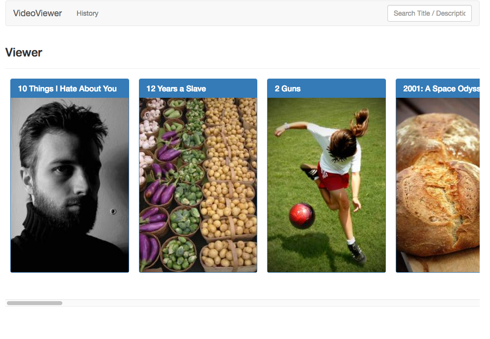

## VideoViewer, a React, Redux App

Instructions on how to run this on your own.
* Install the PostGres App and record its port
* Run "npm install" to install all the dependencies
* To set up and (kinda) seed the database, you can run in the terminal 'psql -f movies.sql'
* CD into the folder and run 'node server.js'
* Go to LocalHost:3000
